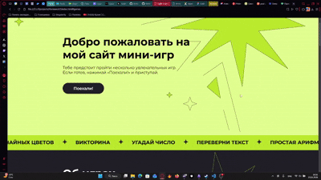

Добро пожаловать на демо-проект с онлайн магазином мебели. 

В этом приложении можно:
1. Перемещаться по страницам сайта при помощи кнопок навигации
2. Просмотреть как работают игры

<div align="center">
   <br>
   
</div>

⭐️ Данный проект содержит ~6 компонентов, часть из которых задокументирована. 
Приложение рабочее и при желании его можно локально развернуть и пользоваться.

Реализован адаптив под мобильные приложения и игры через консоль.


## Технологии
В проекте использованы технологии: JavaScript, HTML, CSS (SASS), БЭМ, Webpack, Git.

## Запуск проекта
``` yarn // установка пакетов```
<br>
```yarn start // запуск проекта и локального сервера```

## Контакты 
Буду рад обратной связи: [ссылка на мой телеграм](https://t.me/Shaddockper).